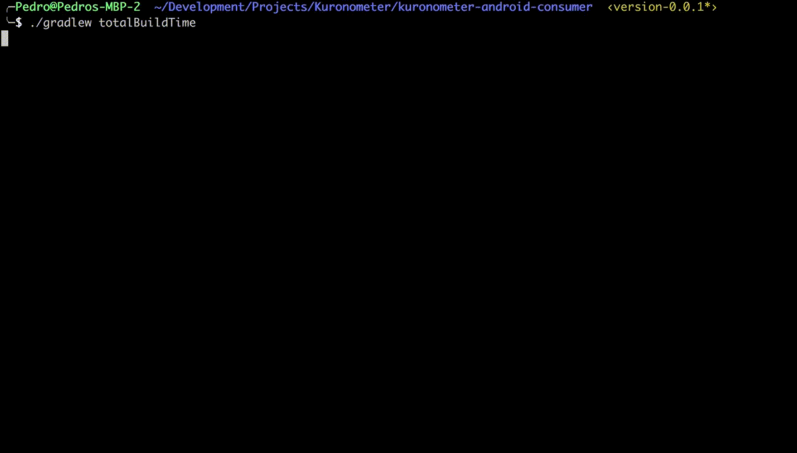

Kuronometer [](https://travis-ci.org/pedrovgs/Kuronometer)
===========

Kuronometer is a [Gradle Plugin](https://docs.gradle.org/current/userguide/custom_plugins.html) developed using purely functional programming in [Scala](https://www.scala-lang.org/). Let's measure how long developers around the world are compiling software!

Using this tool you can see how long you've been compiling your project during the last day or since the last clean execution using just one command:

```
./gradlew totalBuildTime
```

or

```
./gradlew todayBuildTime
```



Additionally, Kuronometer is going to report your build time to a remote service we will use to show how long developers around the world have been building software. Soon, we will publish a real time chronometer with the amount of time we've been building software [here](http://kuronometer.io). Your project data can be reported anonymously, so don't be afraid of using this project. Server side code can be found [here](https://github.com/delr3ves/KuronometerServer).

If you are using Gradle, and at some point during your live as software engineer complained about build times, please install this plugin and help us to show how long we wait for the compiler.


## Installation

Apply the plugin in your ``build.gradle``:

```groovy

buildscript {
  repositories {
    mavenCentral()
  }
  dependencies {
    classpath 'com.github.pedrovgs:kuronometer:0.0.4'
  }
}

apply plugin: "com.github.pedrovgs.kuronometer"

```

## Configuration

You just need to indicate the project platform being used:

```groovy
...
apply plugin: 'kuronometer'

kuronometer {
    platformName = 'Android' //This value can be Android, Java or Scala
}
```

If you need any advanced configuration:

```groovy

kuronometer {
    platformName = 'Android'
    //This value can be true or false. 
    //It's used to remove the project sensitive information before to being reported. By default is true.
    reportProjectInfo = true 
    //This value can be true or false. 
    //It's used to send or not the build report to the kuronometer server. By default is true.
    reportDataRemotely = true
    //This value can be true or false. 
    //It's used to show a message after the build execution showing the report execution result. By default is false.
    verbose = false
}
```

Inside the [kuronometer-consumer](./kuronometer-consumer/build.gradle) and the [kuronometer-android-consumer](./kuronometer-android-consumer/app/build.gradle) folders you can find two configuration examples.

## Build and test this project

To be able to build this project you can execute ``./gradlew build``.

## Run this project

To be able to build this project you can execute these commands:

```
./gradlew install
cd kuronometer-consumer
./gradlew build
```

## Release a new version

Before to release a new kuronometer version remember to update the config build files:

```
gradle.properties
kuronometer-android-consumer/build.gradle
kuronometer-consumer/build.gradle
kuronometer-core/build.gradle
kuronometer/build.gradle
```

Then execute ``./gradlew clean build uploadArchives``. Remember to configure your ``~/.gradle/gradle.properties`` file.

Developed By
------------

* Pedro Vicente Gómez Sánchez - <pedrovicente.gomez@gmail.com>

<a href="https://twitter.com/pedro_g_s">
  
</a>
<a href="https://es.linkedin.com/in/pedrovgs">
  
</a>

License
-------

    Copyright 2017 Pedro Vicente Gómez Sánchez

    Licensed under the GNU General Public License, Version 3 (the "License");
    you may not use this file except in compliance with the License.
    You may obtain a copy of the License at

    http://www.gnu.org/licenses/gpl-3.0.en.html

    Unless required by applicable law or agreed to in writing, software
    distributed under the License is distributed on an "AS IS" BASIS,
    WITHOUT WARRANTIES OR CONDITIONS OF ANY KIND, either express or implied.
    See the License for the specific language governing permissions and
    limitations under the License.
